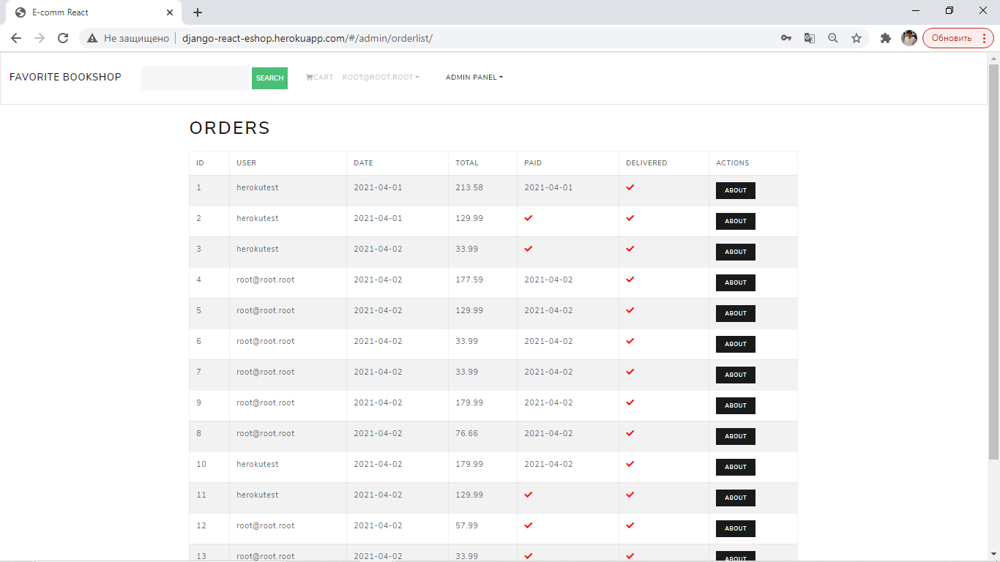
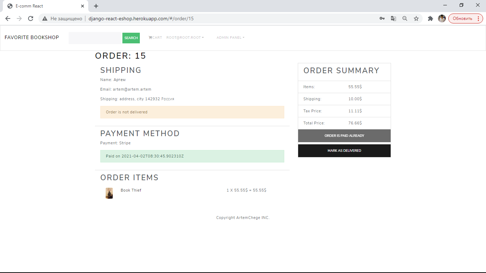

## Полноценный рабочий интернет магазин. Deployed on Heroku. 

###Стек технологий: 
1. Django + Django Rest Framework. 
2. React + Redux. 
3. JWT.
4. Bootstrap 4. 
5. Postgres. 
6. Amazon S3, DB. 
7. Stripe payment system. 
8. Axios. 
9. Heroku + Whitenoise + Gunicorn. 

Функционал сайта: 
1. Регистрация, логин, смена паролей и личных данных. 
2. Покупка товаров. 
3. Личный кабинет юзера. 
4. Просмотр детальной инфрмации о заказе. 
5. Оплата через Stripe. 
6. Кастомная админка с управлением юзерами, заказами, товарами. 

Как выглядит центральная страница: 

Админка: 

Страница заказа: 

Future improvements: 
1. Написать тесты для DRF. 
2. Мелкие багфиксы. 